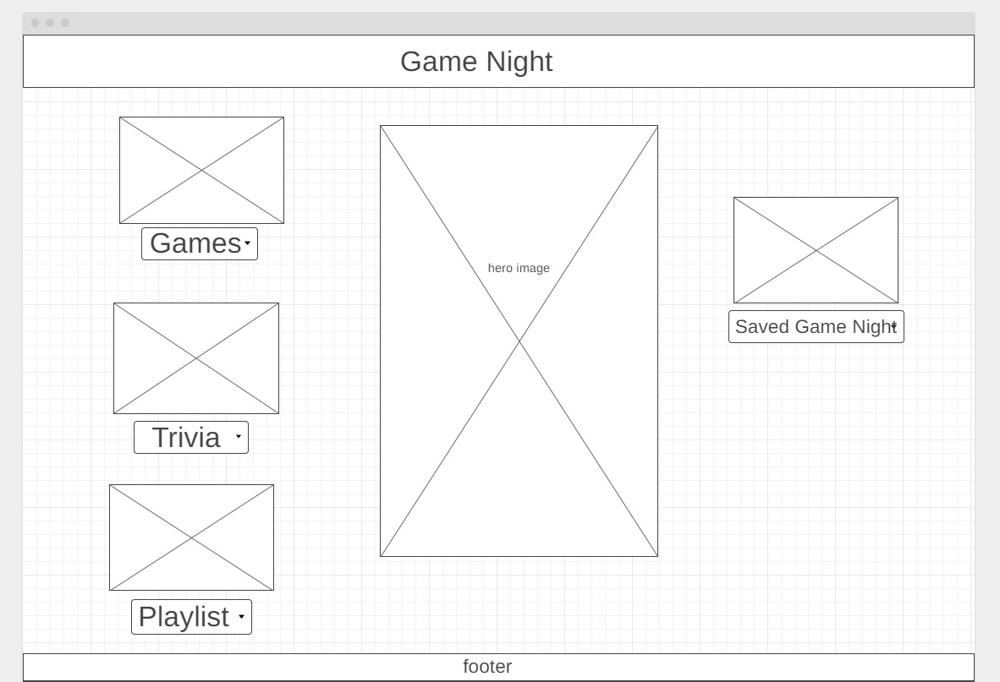
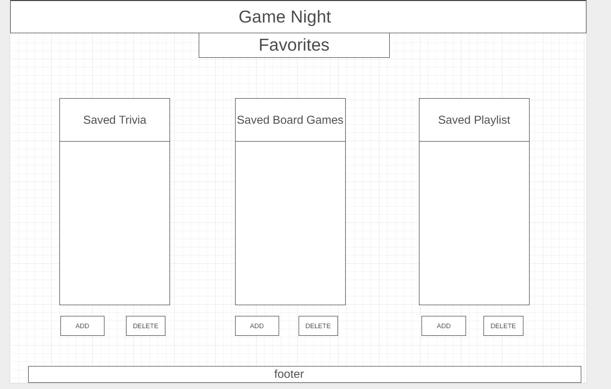
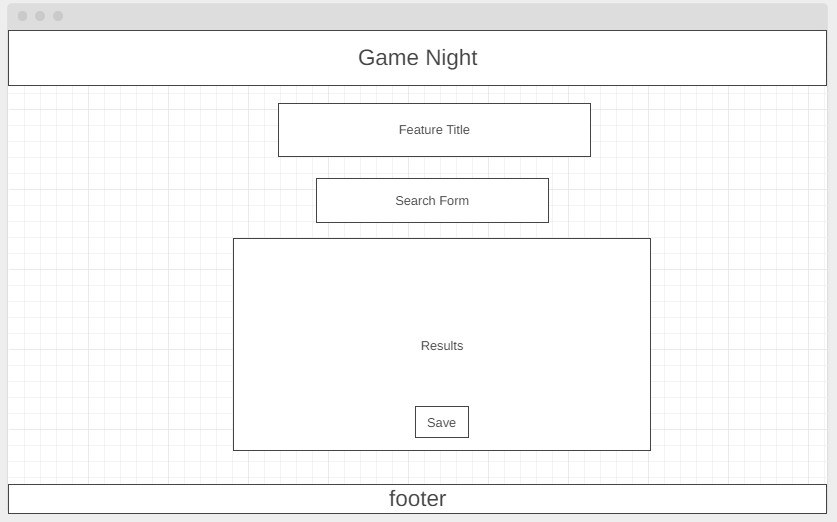
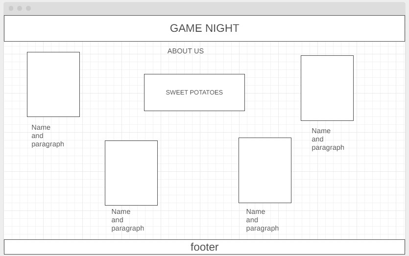
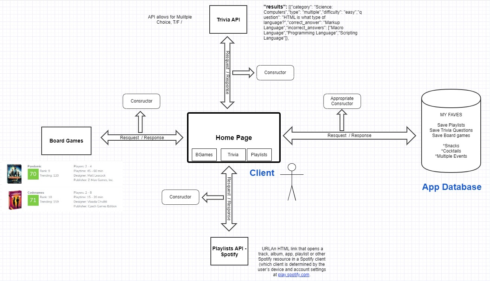
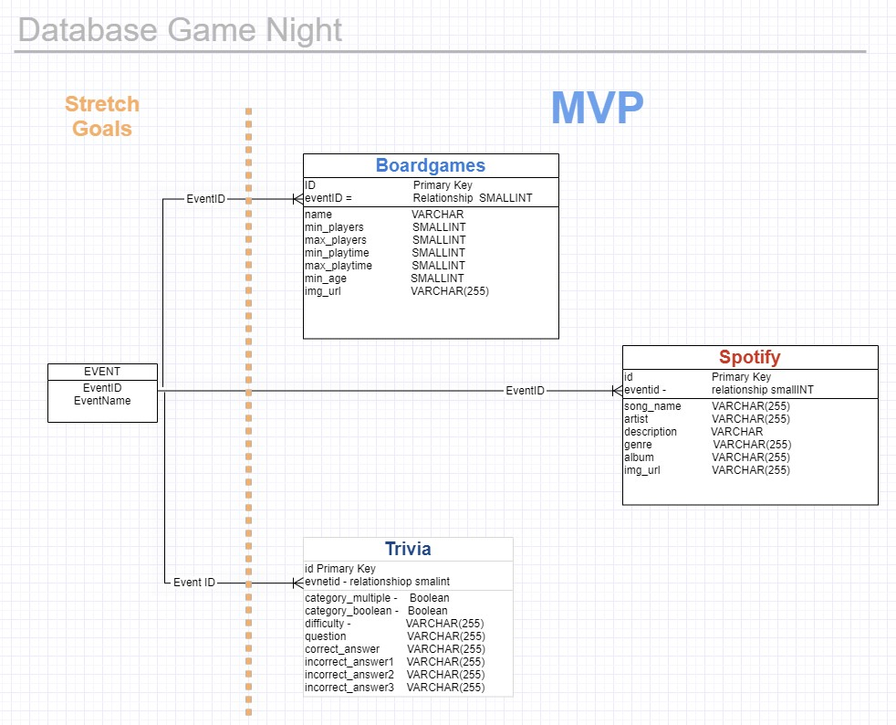

# Game Night

Game Night is an app that allows the users to setup your perfect game night in minutes! Customize a trivia game, pick out board games, and setup a party playlist!

## Sweet Potatoes Team

* [Deanna Johnson](https://www.linkedin.com/in/deanna-johnson406/)
* [Logan Jones](https://linkedin.com/in/loganemilyjones)
* [Michael Campbell](https://www.linkedin.com/in/michael-campbell-85a07b103/)
* [Michael Mandell](https://www.linkedin.com/in/mjmandell/)

## Setup

1. `git clone` [URL](https://github.com/301-Sweet-Potatoes/game-night.git)
1. Create `.env` with `PORT` and `DATABASE_URL`
1. Add your API key for spotify client id and client secret,  and boardgames member id.
1. Run `npm install` to install dependencies

## APIs Used

### Spotify

[Developer Documents](https://developer.spotify.com/documentation/web-api/reference/search/search/)

[Working with Playlists](https://developer.spotify.com/documentation/general/guides/working-with-playlists/)

[Try it out](https://developer.spotify.com/console/get-artist-albums/?id=&include_groups=&market=&limit=&offset=)

### Open Trivia

[Developer Documents](https://opentdb.com/api_config.php)

[Try it Out](https://opentdb.com/api_config.php)

### Boardgames Atlas

[Developer Documents](https://www.boardgameatlas.com/api/docs)

[Try it Out](https://www.boardgameatlas.com/search/)

## Attributions

[Textures for Photoshop](www.textures4photoshop.com)

[Pixabay](www.pixabay.com)

[FreePik](www.freepik.com)

[Gliffy](https://www.gliffy.com/)

[Spotify Web API Node](https://github.com/thelinmichael/spotify-web-api-node)

All the TA's that Helped us out!

and....
***Raymond Ruazol for putting up with us for 2 months!
Thank you RAY!***

## Wireframes

### Home

### Favorites

### Trivia, Board Games, Playlist

### About Us

## Domain Model

## DB ERD

# User Stories

## 1. Create a Trivia Game

As a user, I want search and save trivia questions, so that I can customize a trivia game

#### Feature Tasks

1. Search for a trivia questions (Trivia page)
1. Save trivia question (Trivia page)
1. View saved trivia (My Game Night page)
1. Delete saved trivia questions (My Game Night page)

#### Acceptance Tests

1. Searching for a type of trivia question displays multiple results
1. Pressing the save button will store trivia questions in database/”my game night” page
1. On “my game night”, saved trivia questions are visible/stored in the database
1. On “my game night”, deleting trivia questions remove them from the page and database
1. Error message provided if something goes wrong when searching/saving/deleting

## 2.  Find Board Games

As a user, I want to search and save board games, so that I can remember which board games to bring to game night

#### Feature Tasks

1. Search for board games (Board Games page)
1. Save board games (Board Games page)
1. View saved board games (My Game Night page)
1. Delete saved board games question (My Game Night page)

#### Acceptance Tests

1. Searching for a type of board game displays multiple results
1. Pressing the save button will store board games in database/”my game night” page
1. On “my game night”, saved board games are visible/stored in the database
1. On “my game night”, deleting board games remove them from the page and database
1. Error message provided if something goes wrong when searching/saving/deleting

## 3. Find a Playlist

As a user, I want to search for playlists to play during the event

#### Feature Tasks

1. Search for a playlist (Playlist page)
1. Save a playlist (Playlist page)
1. View saved playlist (My Game Night page)
1. Delete saved playlist (My Game Night page)

#### Acceptance Tests

1. Searching for a type of playlist displays multiple results
1. Pressing the save button will store playlists in database/”my game night” page
1. On “my game night”, saved playlists are visible/stored in the database
1. On “my game night”, deleting playlists remove them from the page and database
1. Error message provided if something goes wrong when searching/saving/deleting

## 4. My Game Night Page

As a user, I want to view all of the things I saved, so that I can have an awesome game night

#### Feature Tasks

1. View saved playlist
1. View saved board games
1. View saved trivia questions
1. Delete saved playlists
1. Delete saved board games
1. Delete saved trivia questions
1. Navigation back to each feature page

#### Acceptance Tests

1. After saving a board games, it is displayed on the page
1. After saving a trivia question, it is displayed on the page
1. After saving a playlist, it is displayed on the page
1. Deleting a list clears it from the page and the database
1. Error message provided if something goes wrong when deleting

## 5. Home Page

As a user, I want to visit a main page, so that I can easily navigate and decide what to include for my game night

#### Feature Tasks

1. View what I can search for
1. Navigate to each feature on the main page 
1. Navigate to My Games Night
1. Navigate to all pages with top nav

#### Acceptance Tests

1. All navigation links on the main page working
1. All navigation link in the top nav working 

## 6. About Us

As a user, I want to learn about who created the site, so I can tell them how awesome they are

#### Feature Tasks

1. View photos and names of group members
1. View short description of the group

#### Acceptance Tests

1. Can navigate to the About Us page
1. Photos and names of group are displayed
1. Group description is displayed

## 7. Visual Appeal

As a user, I want to use a well designed website, so that I want to visit it again and again

#### Feature Tasks

1. Styling is consistent across all pages
1. Pages are responsive and look nice in mWeb and desktop

#### Acceptance Tests

1. Color scheme, fonts, etc are same on all pages
1. Changes the pages size does not break any functionality

## Software Requirements

### Vision 

What is the vision of this product? 

* Allow users to search for everything they need to create an awesome game night!

What pain point does this project solve?

* Planning is stressful, and the last thing you want to think about when you’re excited about a fun night. This app allows you to plan an awesome night in minutes.

Why should we care about your product?

* In these trying times, it’s even more important to enjoy time with each other. This app allows you to focus on fun rather than all of the negative distractions in 2020.

### Scope

In

1. The web app will allow the user to search and browse trivia questions
1. The web app will allow the user to search and browse board games
1. The web app will allow users to search and browse for a Spotify playlist

Out

1. User login -- we will not be implementing the ability for users to log into their own version of the site
2. Play Trivia -- we will not be building functionality to allow a group to play their trivia game on the site

### MVP 

What will your MVP functionality be?

* Save board games
* Delete board games
* Save trivia questions
* Delete trivia questions
* Save playlist
* Delete playlist

### Stretch

What are your stretch goals?

* Store multiple “Game Nights”
* Add your own trivia questions
* Add your own playlist
* Create a shopping/snack list
* Play the spotify playlist

What stretch goals are you going to aim for?

* Store multiple “Game Nights”
* Create a shopping/snack list

[More information](https://docs.google.com/document/d/1bdBOptPR8rW_zPBREWHdcZtzjzthcTh0PZkh01S20Og/edit#)
